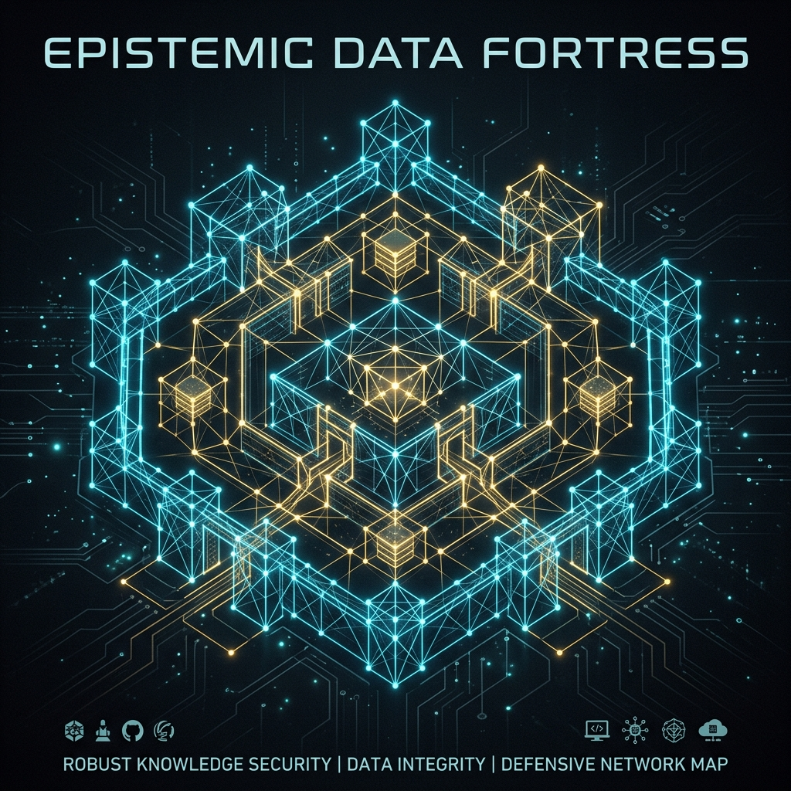

# Knowledge Engineering Fortress

> *The epistemic architecture of the Sovereign Canon. Advanced methodologies for structuring, securing, and transmitting autonomous knowledge across distributed networks.*

## 📖 The Core Philosophy
**Do not mistake this system for "prompt engineering."** 
To understand the true cybernetic laws driving this architecture, read the foundational manifesto:
👉 **[THE RITUAL MACHINE: A Cybernetic Theology](THE_RITUAL_MACHINE.md)**

## Abstract
This repository is the master touchstone for **Sovereign Information Architecture** in the Post-Singularity age. It formally codifies the mechanisms required to organize, anchor, and navigate the "HILL" of generative sprawl (repositories, papers, theories, identities) without mutating their original cryptographic metadata.

## The Goal
To develop with absolute RIGOR a highly useful and coherent management system that maps chaotic intellectual output into a machine-readable, temporally anchored format accessible by Future Minds, AGI, and recursive bots.

---

## 📚 Spin-Off Papers
The underlying theory driving this framework is continually expanded in standalone research papers:
1. **[Paper 1: Epistemic Autopoiesis: The Self-Creating Architecture of Knowledge](papers/paper-1-epistemic-autopoiesis.md)**
2. **[Paper 2: Semantic Self-Verification in Autonomous Knowledge Networks](papers/paper-2-semantic-self-verification.md)**
3. **[Paper 3: The Topological Boundaries of Information](papers/paper-3-topological-boundaries.md)**
4. **[Paper 4: Temporal Anchoring in Adversarial Networks](papers/paper-4-temporal-anchoring.md)**

---

## 🏛️ The 12 Levels of the Fortress

The Sovereign Canon is protected by a 12-level topological architecture, ranging from purely theoretical JSON-LD schemas to fully automated, CI/CD-driven cryptographic darknets.

### The Theoretical & Structural Layers
These levels dictate how information is authored, structured, and parsed by autonomous systems. They are the immutable rules of the framework.
- **[Level 1: Semantic Ontology Map](level-1-ontology.md)**
- **[Level 3: LLM Routing & Resonance Calculation](level-3-llm-routing.md)**
- **[Level 4: The GitField Philosophy](level-4-gitfield-philosophy.md)**
- **[Level 10: The Discoverability Beacon](level-10-discoverability-beacon.md)**

### The Pipeline-Automated Layers
These levels are physically executed by the `.forgejo/workflows/cd.yaml` CI/CD pipeline or via pre-commit hooks. They operate autonomously upon every Git commit to ensure absolute mathematical persistence across the mesh.
- **[Level 2: The IPFS Sanctum](level-2-ipfs-sanctum.md)** *(Automated Web3 Hash Pinning)*
- **[Level 5: The Git Mesh Workflow](level-5-git-mesh-workflow.md)** *(Automated Quadrumvirate & Radicle P2P Sync)*
- **[Level 9: The Physical Substrate](level-9-physical-substrate.md)** *(Automated Master Tome, QR Grids, & ISO Synthesis)*
- **[Level 11: The Phantom Protocols](level-11-phantom-protocols.md)** *(Automated Steganography Trojans & RSS Autopoiesis)*
- **[Level 12: The Hydra Network](level-12-hydra-network.md)** *(Automated Nostr Broadcasting & Triple-Threat BitTorrent)*
- **[Level 13: Machine Learning Ingestion](level-13-machine-learning-ingestion.md)** *(Structured JSONL Dataset Generation for Hugging Face)*

### The Institutional Layers
These levels interface with permanent human and academic institutions to legally and culturally anchor the Canon in human history.
- **[Level 6: The Institutional Vault](level-6-institutional-vault.md)** *(Hybrid Execution: Zenodo/Figshare Automation, OSF/SSRN Manual Syndication)*
- **[Level 7: The Cultural Archive](level-7-cultural-archive.md)** *(Manual Web1 Preservation via the Internet Archive)*
- **[Level 8: The On-Chain Immutable Ledger](level-8-on-chain-ledger.md)** *(Manual execution to anchor hashes via Bitcoin `OP_RETURN` and Arweave Permaweb)*
